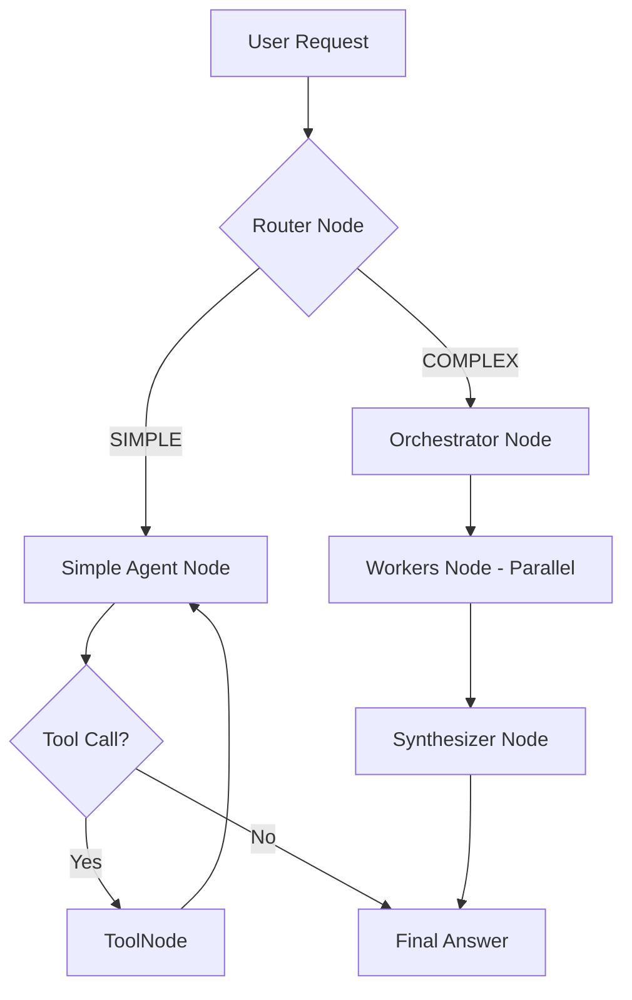

# MCP AI Agent Code Walkthrough

이 문서는 `mcp-ai-agent`의 동작 흐름을 코드 수준에서 하나씩 설명합니다. 이 프로젝트는 **Model Context Protocol (MCP)**을 통해 다양한 모니터링 및 인프라 도구를 통합하고, **LangGraph**를 사용하여 복합적인 추론을 수행하는 AIOps 에이전트입니다.

## 1. 전체 실행 흐름 (Overview)

사용자의 질문이 입력되면 시스템은 다음과 같은 단계를 거쳐 답변을 생성합니다.

---

## 2. 진입점 및 초기화 (Entry Points)

### 🚀 [main.py](file:///c:/Users/jwjin/Desktop/개발/mcp-ai-agent/mcp-api-agent/main.py) & [api_server.py](file:///c:/Users/jwjin/Desktop/개발/mcp-ai-agent/mcp-api-agent/api_server.py)
*   **MCP 연결**: `MCPClient`([mcp_client.py](file:///c:/Users/jwjin/Desktop/개발/mcp-ai-agent/mcp-api-agent/mcp_client.py))를 통해 `config.json`에 정의된 서버들에 연결합니다.
*   **도구 로드**: 각 서버에서 사용 가능한 도구들을 가져와 LangChain의 `StructuredTool` 형태로 변환합니다. 이때 서버 이름을 접두사(예: `k8s_`, `vlogs_`)로 붙여 충돌을 방지합니다.
*   **에이전트 조립**: 로드된 모든 도구를 `create_agent_app(all_tools)`([agent_graph.py](file:///c:/Users/jwjin/Desktop/개발/mcp-ai-agent/mcp-api-agent/agent_graph.py))에 전달하여 두뇌(LangGraph)를 구성합니다.

---

## 3. 핵심 로직: [agent_graph.py](file:///c:/Users/jwjin/Desktop/개발/mcp-ai-agent/mcp-api-agent/agent_graph.py)

에이전트의 논리적 흐름은 LangGraph의 `StateGraph`로 정의되어 있습니다.

### 🔄 Router Node (`router_node`)
사용자의 질문이 단순한 조회인지, 아니면 복합적인 진단이 필요한지 결정합니다.
*   **SIMPLE**: "파드 목록 보여줘", "현재 CPU 사용량 뭐야?" 등 단일 도구로 해결 가능한 요청.
*   **COMPLEX**: "전체적으로 진단해줘", "에러가 왜 발생하는지 분석해봐" 등 다단계 추론과 여러 도구의 교차 검증이 필요한 요청.

### 🛠️ Simple Path (`simple_agent_node`)
표준적인 **ReAct(Reasoning + Acting)** 패턴을 따릅니다.
1.  질문을 분석하고 필요한 도구를 호출합니다.
2.  도구 실행 결과를 보고 답변을 마무리하거나 추가 도구를 호출합니다.
3.  **무한 루프 방지**: 동일한 도구를 같은 인자로 연속 호출하면 차단하는 로직이 포함되어 있습니다.

### 🧠 Complex Path (Orchestrator-Workers)
고급 진단을 위해 분업화된 구조를 사용합니다.

1.  **Orchestrator Node**: 질문을 분석하여 3명의 전문가(Worker)에게 할당할 지시사항(Worker Plans)을 JSON 형태로 작성합니다.
2.  **Workers Node**: 다음 전문가들을 **병렬(Parallel)**로 실행합니다.
    *   **LogSpecialist**: `vlogs` 도구를 사용하여 에러 패턴 분석.
    *   **MetricSpecialist**: `vm`, `vtraces` 도구를 사용하여 리소스 및 트래픽 분석.
    *   **K8sSpecialist**: `kubectl` 도구를 사용하여 설정 및 이벤트 분석.
    *   *각 Worker는 결과를 요약(Summarization)하여 보고서를 제출합니다.*
3.  **Synthesizer Node**: 모든 전문가의 보고서를 취합하여 최종 진단 결과와 해결책을 작성합니다. 이때 "Thinking" 모델을 사용하여 깊이 있는 추론을 수행합니다.

---

## 4. MCP 클라이언트 어댑터

### 🔌 [mcp_client.py](file:///c:/Users/jwjin/Desktop/개발/mcp-ai-agent/mcp-api-agent/mcp_client.py)
MCP 서버와의 통신을 담당합니다.
*   **SSE 연결**: HTTP 기반의 Server-Sent Events를 사용하여 서버와 실시간으로 통신합니다.
*   **Dynamic Schema**: 서버에서 보내준 JSON Schema를 바탕으로 Pydantic 모델을 동적으로 생성하여 LangChain 도구로 변환합니다.
*   **Output Truncation**: 도구 결과가 너무 길 경우(예: 로그 수천 줄), LLM이 처리할 수 있도록 적절히 잘라냅니다(Truncation).

---

## 5. 모니터링 및 스트리밍

### 📊 [api_server.py](file:///c:/Users/jwjin/Desktop/개발/mcp-ai-agent/mcp-api-agent/api_server.py)
*   **OpenAI 호환성**: OpenWebUI 같은 클라이언트에서 사용할 수 있도록 `/v1/chat/completions` 엔드포인트를 제공합니다.
*   **실시간 진행 과정**: 에이전트가 생각하는 과정(`EVENT:`, `TOKEN:`, `FINAL:`)을 스트리밍 큐(`stream_queue`)를 통해 사용자에게 즉시 보여줍니다. 특히 OpenWebUI에서는 `<think>` 태그를 활용하여 내부 추론 과정을 시각화합니다.

---

## 요약

이 코드는 단순한 "챗봇"이 아니라, **인프라 전문가 그룹을 시뮬레이션**하는 구조로 설계되었습니다.
1.  **지휘자(Orchestrator)**가 계획을 세우고,
2.  **전문가(Workers)**들이 각자의 도구로 데이터를 수집 및 요약하며,
3.  **종합가(Synthesizer)**가 최종 결론을 내리는 체계적인 흐름을 가지고 있습니다.
