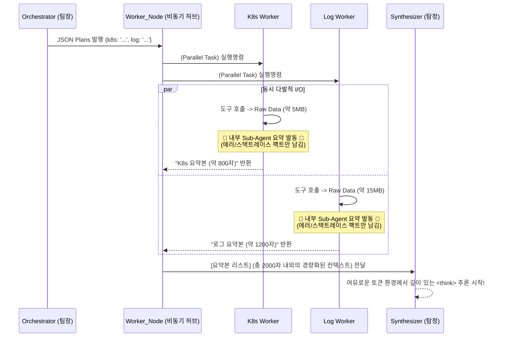

# ⚡ 2. Parallel Workers & Map-Reduce Architecture (심화)

이 문서는 `mcp-ai-agent`의 핵심 경쟁력인 **극단적인 Latency 최적화 기법(Parallel Execution)**과 대규모 로깅 데이터를 안전하게 소화하는 **Sub-Agent Summarization (Map-Reduce)** 아키텍처를 분석합니다.

---

## 🏎️ 1. Parallel Execution (비동기 병렬 처리)

단일 에이전트(Single Agent) 환경에서 도구 N개를 순차 호출(Sequential Call)할 때 발생하는 가장 큰 문제는 O(N)으로 증가하는 응답 지연(Latency)입니다.
최신 SOTA 논문인 **[LLMCompiler (UC Berkeley, 2023)](https://arxiv.org/abs/2312.04511)**의 핵심 개념(Plan-Execute 동시 병렬성)을 차용하여, 우리는 Python의 `asyncio.gather` 패턴을 랭그래프의 노드 내부에 삽입하여 이 문제를 O(1)에 가깝게 최적화했습니다.

### 📝 `workers_node` 내부 비동기 그룹화 메커니즘
```python
async def workers_node(state: AgentState, tools: list):
    # [1] Orchestrator가 작성한 JSON 지시서(worker_plans) 로드
    plans = state["worker_plans"]
    
    # [2] 동시 실행을 위한 코루틴(Coroutine) 리스트
    tasks = []
    
    # [3] 카테고리별로 Worker 생성 (예: K8s, Log, Metric)
    for category, instruction in plans.items():
        if instruction.strip():
            # 의존성 주입: 해당 Worker에 맞는 도구만 필터링하여 전달
            category_tools = filter_tools(tools, category)
            # 코루틴 객체만 리스트에 담음 (아직 실행 안 됨!)
            tasks.append(run_single_worker(f"[{category}] Worker", instruction, category_tools))
            
    # [4] 폭발적인 동시성 제어 (Concurrency)
    # 3개의 Task가 블로킹 없이 네트워크 I/O를 동시에 수행!
    results = await asyncio.gather(*tasks, return_exceptions=True)
```

**[🔥 아키텍처적 의의]**
단순히 `run_single_worker`를 await로 3번 부르는 것(동기식)과, 리스트로 담아 `gather`로 한방에 부르는 것(비동기 병렬식)의 차이는 타임아웃 방어에 절대적인 영향을 미칩니다.
AIOps 특성상 쿼리를 날리는 VictoriaLogs 벡엔드 응답이 지연될 수 있습니다. 비동기 I/O를 통해, K8s 응답이 먼저 오더라도 메인 스레드는 블로킹당하지 않고 Log 응답을 기다리며, **전체 응답 시간은 "가장 느린 단일 도구"의 응답 시간과 동일해집니다.**

---

## 🗜️ 2. Sub-Agent Summarization (Map-Reduce 패턴의 완성)

단순히 병렬 호출만 하면, 반환된 데이터를 메모리에 들고 있다가 모델에 주입하는 순간 **`Context Length Exceeded`** 에러 폭탄이 터집니다. (이른바 Context Trap)
이 현상을 근본적으로 해결하기 위해, 우리는 사고(Reasoning)와 관찰(Observation)을 분리할 것을 주창한 **[ReWOO (2023)](https://arxiv.org/abs/2305.18323)** 논문의 아이디어를 도입했습니다.
각 워커(`run_single_worker`) 내부에 **단기 요약 담당 Sub-Agent (Map-Reduce의 Map 작업자)**를 내장하여, 날 것의 데이터(Raw Observation)가 시스템 본진을 어지럽히지 못하게 통제합니다.



### 📝 Map-Reduce의 구현(`run_single_worker` 내 요약 프롬프트)
Worker는 도구에서 Raw Data를 꺼내온 직후, 이를 결재판(`AgentState.worker_results`)에 바로 올리지 않고, 자신을 초기화(invoke)했던 동일한 **Instruct LLM**에게 한 번 더 명령을 내립니다.

```python
summarize_prompt = f"""
다음은 네가 실행한 도구의 결과(Raw Data)다.
절대 지어내지 말고, 데이터에 있는 **에러(Error), 스택트레이스, 핵심 팩트**만 요약해라.
길이는 무조건 **1000자 이내**로 압축해라. 그래야 메인 시스템이 터지지 않는다.
"""
```
**[결과 (Reduce)]**: 거대한 `ENOBUFS` 위협 요인(수십 메가바이트짜리 텍스트 로그)들이 분산된 Worker 노드 단에서 철저하게 전처리(Map)되어, Synthesizer 노드에는 정제된 알짜배기(Reduce)만 인입됩니다. **시스템의 생존성과 퍼포먼스를 동시에 끌어올린 AIOps 아키텍처의 핵심입니다.**

---
👉 **[이전으로 돌아가기 (초보자용 2장: 아키텍처 개요)](../paper/2_CORE_ARCHITECTURE.md)**
