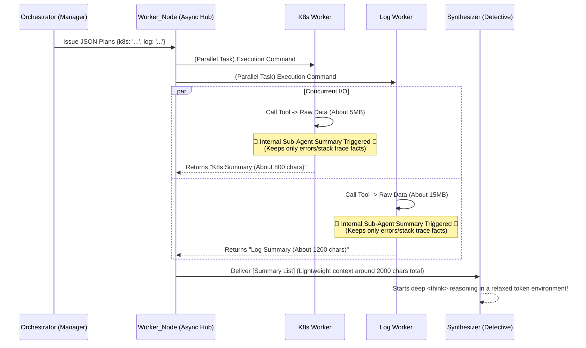

# ⚡ 2. Parallel Workers & Map-Reduce Architecture (Advanced)

This document analyzes the core competitive edges of the `mcp-ai-agent`: the **Extreme Latency Optimization Technique (Parallel Execution)** and the **Sub-Agent Summarization (Map-Reduce)** architecture to safely digest large-scale logging data.

> This is an advanced architecture/performance document. For current deployment and runtime settings, see [`mcp-api-agent/DEPLOYMENT_GUIDE.md`](../mcp-api-agent/DEPLOYMENT_GUIDE.md).

---

## 🏎️ 1. Parallel Execution (Asynchronous Parallel Processing)

The biggest problem with calling N tools sequentially in a Single Agent environment is the response latency increasing to O(N).
Borrowing the core concept (Plan-Execute concurrent parallelism) from the latest SOTA paper, **[LLMCompiler (UC Berkeley, 2023)](https://arxiv.org/abs/2312.04511)**, we inserted Python's `asyncio.gather` pattern inside the LangGraph node to optimize this close to O(1).

### 📝 Asynchronous Grouping Mechanism inside `workers_node`
```python
async def workers_node(state: AgentState, tools: list):
    # [1] Load JSON instructions (worker_plans) written by the Orchestrator
    plans = state["worker_plans"]
    
    # [2] List of Coroutines for concurrent execution
    tasks = []
    
    # [3] Create Workers by category (e.g., K8s, Log, Metric)
    for category, instruction in plans.items():
        if instruction.strip():
            # Dependency Injection: Filter and pass only the tools relevant to that Worker
            category_tools = filter_tools(tools, category)
            # Add only the coroutine object to the list (not executed yet!)
            tasks.append(run_single_worker(f"[{category}] Worker", instruction, category_tools))
            
    # [4] Explosive Concurrency Control
    # 3 Tasks perform Network I/O simultaneously without blocking!
    results = await asyncio.gather(*tasks, return_exceptions=True)
```

**[🔥 Architectural Significance]**
The difference between simply awaiting `run_single_worker` 3 times (synchronized) and putting them in a list and awaiting them all at once via `gather` (asynchronous parallel) directly affects timeout defense.
In AIOps, VictoriaLogs backend responses sending queries can be delayed. Through asynchronous I/O, even if the K8s response comes first, the main thread is not blocked and waits for the Log response. **The overall response time becomes identical to the response time of the "slowest single tool."**

---

## 🗜️ 2. Sub-Agent Summarization (Completion of the Map-Reduce Pattern)

If we merely perform parallel calls, the moment the returned data is held in memory and injected into the model, a **`Context Length Exceeded`** error bomb explodes. (The so-called Context Trap)
To fundamentally solve this phenomenon, we introduced the idea from the **[ReWOO (2023)](https://arxiv.org/abs/2305.18323)** paper, which advocated separating Reasoning and Observation.
Inside each worker (`run_single_worker`), an **internal short-term summary Sub-Agent (Map-Reduce's Map worker)** is embedded, tightly controlling the Raw Observation data so it doesn't mess up the main system.



### 📝 Implementing Map-Reduce (Summary Prompt inside `run_single_worker`)
Immediately after pulling Raw Data from the tool, the Worker doesn't put it straight onto the clipboard (`AgentState.worker_results`). Instead, it gives one more command to the **same Instruct LLM** that initialized it (`invoke`).

```python
summarize_prompt = f"""
Here is the result (Raw Data) of the tool you ran.
Do not fabricate anything; summarize only the **Error, Stack Trace, and Core Facts** present in the data.
Compress the length absolutely to **under 1000 characters**. Only then will the main system not crash.
"""
```
**[Result (Reduce)]**: Massive `ENOBUFS` threats (text logs tens of megabytes large) are strictly preprocessed (Map) at the distributed Worker node level, ensuring that only refined, prime essence (Reduce) flows into the Synthesizer node. **This is the core of an AIOps architecture that boosts both system survivability and performance simultaneously.**

---
👉 **[Go Back (Beginner Chapter 2: Core Architecture)](../paper/2_CORE_ARCHITECTURE_en.md)**
