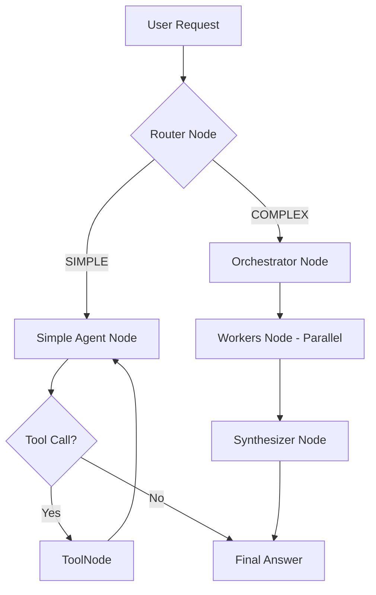

# MCP AI Agent Code Walkthrough

This document explains the operational flow of `mcp-ai-agent` step-by-step at the code level. This project is an AIOps agent that integrates various monitoring and infrastructure tools via the **Model Context Protocol (MCP)** and performs complex reasoning using **LangGraph**.

## 1. Overall Execution Flow (Overview)

When a user's question is input, the system generates an answer through the following steps.

---

## 2. Entry Points & Initialization

### 🚀 [main.py](file:///c:/Users/jwjin/Desktop/개발/mcp-ai-agent/mcp-api-agent/main.py) & [api_server.py](file:///c:/Users/jwjin/Desktop/개발/mcp-ai-agent/mcp-api-agent/api_server.py)
*   **MCP Connection**: Connects to the servers defined in `config.json` via `MCPClient` ([mcp_client.py](file:///c:/Users/jwjin/Desktop/개발/mcp-ai-agent/mcp-api-agent/mcp_client.py)).
*   **Tool Loading**: Fetches the available tools from each server and converts them into LangChain's `StructuredTool` format. At this time, it adds the server name as a prefix (e.g., `k8s_`, `vlogs_`) to prevent collisions.
*   **Agent Assembly**: Passes all loaded tools to `create_agent_app(all_tools)` ([agent_graph.py](file:///c:/Users/jwjin/Desktop/개발/mcp-ai-agent/mcp-api-agent/agent_graph.py)) to construct the brain (LangGraph).

---

## 3. Core Logic: [agent_graph.py](file:///c:/Users/jwjin/Desktop/개발/mcp-ai-agent/mcp-api-agent/agent_graph.py)

The agent's logical flow is defined with LangGraph's `StateGraph`.

### 🔄 Router Node (`router_node`)
Determines whether the user's question is a simple lookup or requires complex diagnosis.
*   **SIMPLE**: Requests that can be resolved with a single tool, like "Show me the pod list," "What is the current CPU usage?"
*   **COMPLEX**: Requests requiring multi-stage reasoning and cross-validation of multiple tools, like "Diagnose the entire system," "Analyze why an error is occurring."

### 🛠️ Simple Path (`simple_agent_node`)
Follows the standard **ReAct (Reasoning + Acting)** pattern.
1.  Analyzes the question and calls the necessary tools.
2.  Looks at the tool execution results and completes the answer or calls additional tools.
3.  **Infinite Loop Prevention**: Includes logic to block calling the same tool with the same arguments consecutively.

### 🧠 Complex Path (Orchestrator-Workers)
Uses a specialized, divided structure for advanced diagnosis.

1.  **Orchestrator Node**: Analyzes the question and writes instructions (Worker Plans) in JSON format to assign to 3 specialists (Workers).
2.  **Workers Node**: Executes the following specialists in **Parallel**.
    *   **LogSpecialist**: Analyzes error patterns using `vlogs` tools.
    *   **MetricSpecialist**: Analyzes resources and traffic using `vm`, `vtraces` tools.
    *   **K8sSpecialist**: Analyzes configurations and events using `kubectl` tools.
    *   *Each Worker submits a report by Summarizing the results.*
3.  **Synthesizer Node**: Aggregates the reports from all specialists to write the final diagnosis result and solution. It uses a "Thinking" model to perform in-depth reasoning here.

---

## 4. MCP Client Adapter

### 🔌 [mcp_client.py](file:///c:/Users/jwjin/Desktop/개발/mcp-ai-agent/mcp-api-agent/mcp_client.py)
Responsible for communication with MCP servers.
*   **SSE Connection**: Communicates with the server in real-time using HTTP-based Server-Sent Events.
*   **Dynamic Schema**: Dynamically generates Pydantic models based on the JSON Schema sent from the server to convert them into LangChain tools.
*   **Output Truncation**: If the tool result is too long (e.g., thousands of log lines), it appropriately truncates it so the LLM can process it.

---

## 5. Monitoring & Streaming

### 📊 [api_server.py](file:///c:/Users/jwjin/Desktop/개발/mcp-ai-agent/mcp-api-agent/api_server.py)
*   **OpenAI Compatibility**: Provides a `/v1/chat/completions` endpoint for use with clients like OpenWebUI.
*   **Real-time Progress**: Immediately shows the user the agent's thinking process (`EVENT:`, `TOKEN:`, `FINAL:`) via a streaming queue (`stream_queue`). Especially in OpenWebUI, it uses the `<think>` tag to visualize the internal reasoning process.

---

## Summary

This code is designed not just as a simple "chatbot," but as a structure that **simulates a group of infrastructure experts**.
It has a systematic flow where:
1.  The **Orchestrator** plans,
2.  The **Workers** collect and summarize data with their respective tools,
3.  The **Synthesizer** draws the final conclusion.
