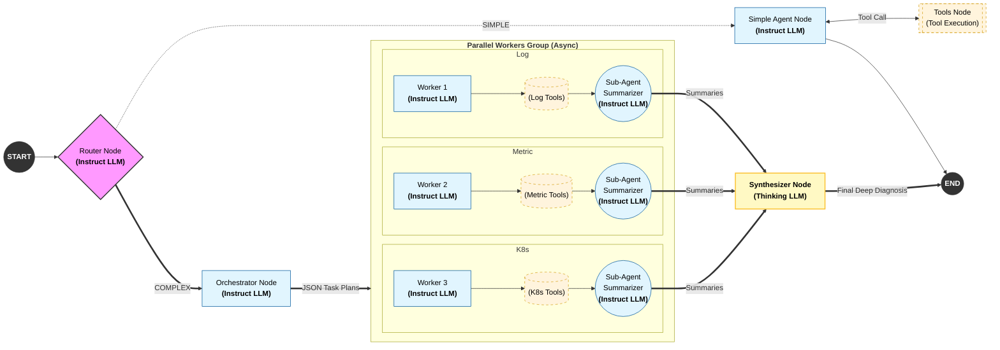
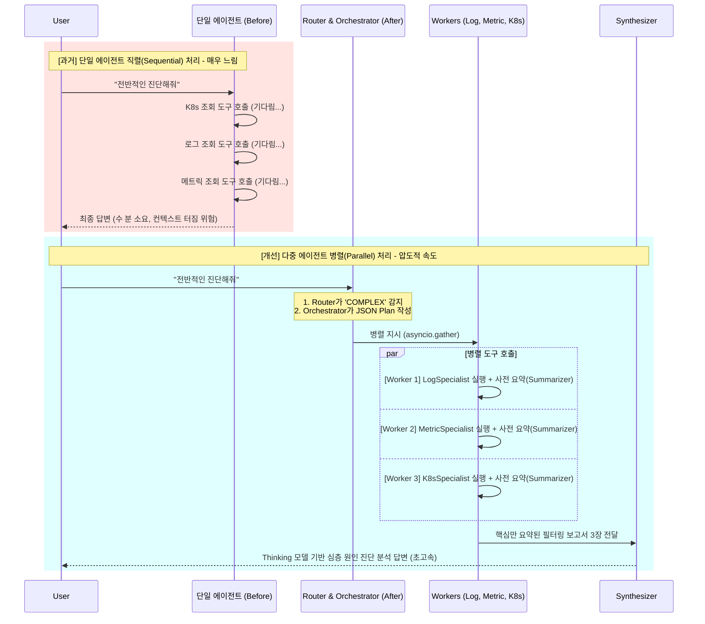

# MCP 개발 히스토리 요약 (AIOps Agent)

본 문서는 LangGraph 기반 단일 에이전트에서 완전한 **Orchestrator-Workers 병렬 처리 아키텍처**로 진화하기까지의 MCP(Model Context Protocol) 개발 히스토리를 요약합니다. 
단순히 연동하는 것을 넘어, 발생했던 여러 심각한 문제점(타임아웃, 무한 루프, 데이터 절단, 지연시간)들을 코드단에서 **어떻게(How)** 해결했고, 그 **결과(Result)**는 어떠했는지 매우 상세히 기록합니다.

---

## 🗺️ 전체 시스템 워크플로우 (Current Architecture)

현재 완성된 시스템(`agent_graph.py`)의 전체 동작 흐름은 다음과 같습니다. 사용자 질문의 복잡도를 가장 먼저 판단하여 두 갈래의 길(Simple Path vs Complex Path)로 라우팅하는 것이 핵심입니다.

### 💡 시각화: LangGraph 전체 노드(Node) 흐름도


*   **동작 원리 요약:**
    1.  **START:** 사용자 요청이 들어오면 સૌથી 먼저 `Router`(Instruct 모델)가 질문을 분석합니다.
    2.  **분기 결단 (Routing):** 
        *   단순한 리소스 조회("파드 목록 줘") 라면 **Simple Path**로 보냅니다.
        *   원인 분석이나 종합 진단("웹이 왜 안열리지?", "전체 상태 어때?") 같은 복합 사고가 필요하다면 **Complex Path**로 보냅니다.
    3.  **Simple Path 작동 방식:** 무거운 계획 수립 없이 바로 단일 에이전트(`SimpleAgent`)가 즉각적으로 필요한 도구(`Tools`)를 호출하고 결과를 반환받아 초고속으로 대답하고 끝납니다. (단순 ReAct 패턴)
    4.  **Complex Path 작동 방식:**
        *   `Orchestrator`: 전체 상황을 파악하여 각 분야 전문가들에게 내릴 세부 지시(JSON Plan)를 생성합니다.
        *   `Workers (병렬화 및 사전 요약 단계)`: 
            *   이 지시를 받아 3명의 전문가(Log, Metric, K8s)가 각자의 도구를 **동시(Parallel)** 에 호출합니다.
            *   **(핵심 🌟) Sub-Agent Summarization (Map-Reduce 파이프라인):** 도구에서 반환된 거대한 Raw Data를 그대로 Synthesizer에게 넘기지 않습니다! 토큰 오버플로우를 막기 위해 **Worker 내부에 내장된 요약 담당자(Sub-Agent Summarizer)가 개입하여, 에러 스택 트레이스나 중요 팩트만 단 1,000자 이내로 사전 요약(Map 작업)합니다.**
        *   `Synthesizer`: 최종적으로 강력한 `Thinking 모델`이 세 명의 Worker가 정제해서 가져온 "요약 브리핑 문건 3장"만을 취합(Reduce 작업)하여 에러의 Root Cause(근본 원인)를 찾아내고, 인과관계가 명확한 최종 진단을 내립니다.

---

## [Phase 1] MCP 도구 연동 및 LangGraph 기초 구성 (2026.01.28)

K8s(Kubectl), VictoriaLogs, VictoriaMetrics 등의 이기종 외부 도구를 단일 LangChain Tool 인터페이스로 사용하기 위한 기반 공사 단계였습니다.

*   **적용 사안 (How It Was Implemented):**
    *   `mcp_client.py`, `mcp_client_adapter.py` 등의 컴포넌트를 구현.
    *   `AsyncExitStack`과 `ClientSession`을 통해 MCP 서버들과의 비동기 세션을 영속적으로 관리하도록 구축.
    *   `pydantic.create_model`을 활용하여, MCP 서버가 제공하는 도구의 원시 JSON 스키마를 LangChain이 인식할 수 있는 Pydantic 모델(Tool Schema)로 런타임에 동적 변환하여 바인딩.

*   **적용 결과 (The Results):**
    *   단 하나의 에이전트(`simple_agent_node`)가 여러 종류의 MCP 서버가 제공하는 수십 개의 도구들을 자유롭게 조회(Tool Calling)할 수 있는 기초 통신망이 완벽하게 성립되었습니다.

---

## [Phase 2] LLM 연동 안정화 및 환각(루프) 디버깅 (2026.02.01)

고성능 모델(Thinking Model)을 LangGraph 에이전트에 붙이자, 모델의 깊은 추론 시간으로 인한 "세션 끊김" 현상과 "의미 없는 도구 반복 호출(무한 루프)" 문제가 발생했습니다.

### 💡 시각화: 무한 루프(Hallucination) 방어 로직
```mermaid
flowchart TD
    A[LLM이 도구 호출 요청] --> B{직전 메시지에 동일한 도구/인자 호출 기록이 있는가?}
    B -- Yes (중복) --> C[배열에서 해당 도구 호출 강제 삭제]
    C --> D[시스템 메시지 반환: '이미 최신 데이터를 확보했습니다. 중복 실행 방지됨']
    B -- No (정상) --> E[정상적으로 도구(Tool) 실행]
```

*   **적용 사안 (How It Was Implemented):**
    *   **타임아웃 및 세션 연결 디버깅:** `config.py`와 모델 초기화(`get_thinking_model`)에서 `request_timeout`을 3600초(1시간)로 넉넉히 연장. 또한 긴 추론 대기 시간으로 인해 연결이 끊기는(`peer closed connection`, `Attempted to exit a cancel scope`) 문제를 해결하기 위해 `streaming=True` 속성을 켜서 더미 패킷(토큰)이라도 지속적으로 수신하도록 방어.
    *   **무한 루프(Hallucination) 방어 알고리즘:** 위 다이어그램과 같이 `check_and_filter_duplicate_tools` 함수를 신규 구현. 직전 응답(`last_ai_msg.tool_calls`)의 도구 이름(`name`)과 인자(`args`)가 현재 호출하려는 도구와 완벽히 겹친다면, 프롬프트상 배열에서 해당 도구를 강제로 지워버리고(Deduplication), 사용자에게 `"[System] 이미 최신 데이터를 확보했습니다. (중복 실행 방지됨)"` 메시지를 리턴하도록 제어 로직 추가.
    *   **문맥 경량화 적용:** `Smart Sliding Window` 기술(`trim_messages_history`)을 도입해, 가장 중요한 시스템 프롬프트(0번 인덱스)는 남겨둔 채 최근 N개의 대화 기록만 List 슬라이싱하여 LLM에 주입.

*   **적용 결과 (The Results):**
    *   딥-씨킹(Deep-thinking) 과정 중에 시스템이 뻗어버리는 불안정이 100% 해소되었습니다.
    *   "나는 로그를 볼게" 라고 해놓고 똑같은 `vlogs_query`를 동일한 인자로 수십 번씩 무의미하게 호출하던 무한 루프 악순환이 완전히 차단되었습니다.
    *   모델이 처리하는 평균 컨텍스트 토큰 양이 대폭 줄어 속도 향상과 비용(Token Usage) 절감 효과를 얻었습니다.

---

## [Phase 3] 아키텍처 대공사 및 병렬 처리 최적화 (2026.02.23)

과거 순차적(Sequential)인 단일 에이전트 구조에서는, 한 번의 질문으로 "로그 확인 -> K8s 확인 -> 메트릭 확인"을 연달아 수행할 때까지 응답 속도가 견딜 수 없이 느렸습니다(최대 수 분 소요). 또한 한 명의 에이전트가 모든 정보를 머리에 담으려다 보니(Context Overflow) 판단력이 흐려졌습니다. 여기서 "논문 기반 아키텍처" 기법들이 융합 적용됩니다.

### 💡 시각화: 아키텍처 비교 (Before vs After)


*   **적용 사안 (How It Was Implemented):**
    *   **라우터(Router) 노드 도입:** 사용자의 질문을 `SIMPLE` (단순한 리소스 조회 등)과 `COMPLEX` (원인 분석, 종합 진단 등) 두 가지 모드로 초장부터 분류(Routing)하도록 프롬프트 디자인. (`router_node`)
    *   **Orchestrator-Workers 병렬 패턴 전면 개편(핵심 개선):**
        *   `orchestrator_node`: 질문을 보고, `LogSpecialist`, `MetricSpecialist`, `K8sSpecialist` 세 분야의 전문가(Worker)들에게 각각 어떤 조사를 명령할지 **"JSON 구조의 Plan"**을 한 방에 생성합니다.
        *   `workers_node`: 이 Plan을 넘겨받아 `run_single_worker`가 비동기 태스크 그룹(`asyncio.gather(*tasks)`)으로 취합되어 실행됩니다. 즉, 위 시퀀스 다이어그램처럼 **세 명의 전문가가 동시에 자신의 도구에 데이터를 질의(Parallel Execution)**하게 되며, 내부의 요약 담당자(Sub-Agent Summarization - Map-Reduce)가 거대해진 `raw_data`를 핵심 팩트(Stack Trace 등)만 남겨 필터링 및 요약합니다.
        *   `synthesizer_node`: 각 전문가가 요약해온 핵심 브리핑(`worker_results`)만 종합하여 최종적으로 심도 있는 Root Cause를 진단합니다.

*   **적용 결과 (The Results):**
    *   과거 직렬 실행일 때 한 세월 걸리던 분석 시간이 도구를 **동시에 질의(Parallel)** 함으로써 Latency(지연 시간)가 비약적으로 단축되었고 응답이 극도로 빨라졌습니다.
    *   모든 로우 데이터를 메인 LLM이 다 읽다 터지던 문맥 오버플로우 한계(Context Trap)를, "사전 요약(Sub-Agent Summarizer)" 역할을 수행하는 Worker 내부 로직에게 위임함으로써 완벽히 해결했습니다.

---

## [Phase 4] LLM 모델 이원화 튜닝 (Thinking vs Instruct 교체) (2026.02.23)

단일 능력을 가진 모델 하나로 모든 것을 처리하려다 보니, "JSON 파싱 에러(JSON Decode Error)"나 형식 오류가 잦았고, 아주 가벼운 판단에도 딥-씽킹(Deep-Thinking)을 하느라 수 분이 지연되는 부작용이 속출했습니다. 이를 해결하기 위해 노드별로 **최적의 모델(Instruct vs Thinking)을 스왑(Swap)**하여 이원화하는 과정을 거쳤습니다.

### 💡 시각화: 모델 분리 전/후 구조 비교 (JSON 치명적 오류 해결)
```mermaid
flowchart TD
    subgraph SG1 ["<b>[Before] 과거 구조 (단일 씽킹 모델)</b><br>형식 파괴 및 타임아웃 잦음"]
        direction TB
        O_bad["Orchestrator<br/>(Thinking Model)"]
        TEXT_bad["💡 사유과정: &lt;think&gt;블라블라...&lt;/think&gt;<br/>{ 'log': '가져와' }"]
        ERROR(("❌ JSON Decode Error<br/>(포맷이 깨져 시스템 중단)"))
        
        O_bad -->|출력| TEXT_bad
        TEXT_bad -->|JSON.loads()| ERROR
    end
    
    subgraph SG2 ["<b>[After] 현재 구조 (이원화 최적화)</b><br>명령은 빠르고 정확하게, 추론은 깊게"]
        direction TB
        O_good["<b>Orchestrator / Router / Worker</b><br/>(Instruct Model)"]
        TEXT_good["{ 'log': '가져와' }<br/>(깔끔하고 빠른 규격 프롬프트)"]
        SUCCESS(("✅ 파싱 및 실행 성공"))
        SYNTH["<b>Synthesizer</b><br/>(Thinking Model)"]
        FINAL(("🎯 깊이 있는 최종 원인 분석"))
        
        O_good -->|출력| TEXT_good
        TEXT_good -->|JSON.loads()| SUCCESS
        SUCCESS -->|요약본 3장 전달| SYNTH
        SYNTH -->|마지막 진단에만 사고력 집중| FINAL
    end
```

*   **적용 사안 (How It Was Implemented):**
    *   **Orchestrator 노드의 Instruct 모델 전환 (핵심):** 과거 Orchestrator는 씽킹 모델(`<think>` 태그)을 사용하여 자신의 내부 생각과 JSON 포맷을 섞어 출력했습니다. 이로 인해 파이썬 코드단에서 `json.loads()`를 할 때 형식이 자주 깨져 런타임 에러(시스템 멈춤)가 발생했습니다. 이에 빠르고 일관된 답변 포맷(JSON) 생성을 매우 잘 지키는 **`Instruct 모델`**로 전면 교체하여 시스템의 안정성을 확보했습니다.
    *   **Router & Workers 노드 경량화:** 라우터와 3명의 워커(Log, Metric, K8s) 노드에도 가볍고 빠른 **`Instruct 모델`**을 배정하여, 단순히 상황을 분류하고 하달받은 명령에 맞게 도구를 실행/요약하는 기계적인 작업을 빛의 속도로 병렬 처리하도록 개편했습니다.
    *   **Synthesizer 노드의 Thinking 역량 집중:** 거대한 데이터 요약본들을 취합해 "최종 인과관계"를 추론하고 'Root Cause(진단)'를 도출해 내는 마지막 화룡점정인 Synthesizer 노드에는 **`Thinking 모델`**을 전담 배치했습니다. 문맥이 정제되어 있으므로 컨텍스트 초과 에러 없이 순수 추론에만 깊게 사고할 수 있도록 판을 깔았습니다.

*   **적용 결과 (The Results):**
    *   **런타임 에러 제로(0):** Orchestrator가 기계처럼 완벽한 포맷의 JSON Plan만을 출력하게 되어 워크플로우 중간에 에러로 뻗어버리는 치명적 결함이 사라졌습니다.
    *   "지시(Instruct)는 빠르고 정확하게, 추론(Thinking)은 핵심 데이터만 가지고 깊게" 라는 완벽한 비용/속도/지능의 밸런스가 달성되었습니다.

---

## [Phase 5] 도메인 특화 프롬프트 튜닝 및 데이터 절단(Truncation) 방어 (2026.02.24)

이전 공사로 프레임워크는 완성되었으나, 로그나 메트릭 검색 시 터무니없이 방대한 데이터 덩어리가 넘어오면 여전히 Langchain의 통신 버퍼(ENOBUFS)가 터지거나 컨텍스트 윈도우 한계로 텍스트가 잘리는(Truncation) 실무적인 오류가 남아있었습니다.

*   **적용 사안 (How It Was Implemented):** `agent_graph.py`의 `run_single_worker` 내부에 각각의 **Specialist 프롬프트 규칙(Rule)**을 K8s 및 모니터링 시스템의 도메인 특화 성향으로 강력 매핑했습니다.
    *   **Log Specialsit:** 에이전트에게 **`now-1h`** (최근 1시간 검색 범위) 및 도구의 **`limit=50`** 파라미터를 강제했습니다. 특히 동일한 에러 로그가 폭주하여 다른 원인을 못 찾는 현상을 막기 위해, **LogsQL 파이프라인 연산자인 `| collapse_nums`**를 붙여서 비슷한 에러 로그들을 압축하라고 명시적으로 룰셋(Prompt)을 작성했습니다.
    *   **Metric Specialist:** 클러스터 전체 조회 시 데이터가 터지는 걸 방어하기 위해 PromQL 쿼리에 반드시 **`topk(10, ...)`**(상위 10개 파드 위주 수집)을 사용하라는 가이드라인을 주입했습니다.
    *   **K8s Specialist:** `allNamespaces` 전체 조회 시 텍스트 폭주를 막도록 **`output="name"`** 지시어만으로 데이터를 1차 필터링하도록 강제했습니다. 또한 조회 필터로 "빈 결과 반환 시 통신 에러가 아니라 클러스터가 완벽하게 건강함을 의미한다"라는 고도의 도메인 지식을 프롬프트에 주입(환각 진단 방지)했습니다.

*   **적용 결과 (The Results):**
    *   대용량 K8s 클러스터 환경에서도 통신 버퍼 용량 초과(`ENOBUFS`) 및 데이터 절단으로 인해 정보가 유실되어 모델이 멍청한 진단을 내리는 장애를 원천 봉쇄했습니다.
    *   에이전트에게 "가장 중요한 K개(Top K)", "중복되는 노이즈는 압축(Collapse)" 하도록 강제하여, 훨씬 더 선명해진 원인(Raw Data)을 취득한 뒤 "진짜 Root Cause(핵심 Stack Trace)"만 신속하게 정밀 타격하듯 짚어낼 수 있는 초-최적화 상태를 달성했습니다.
