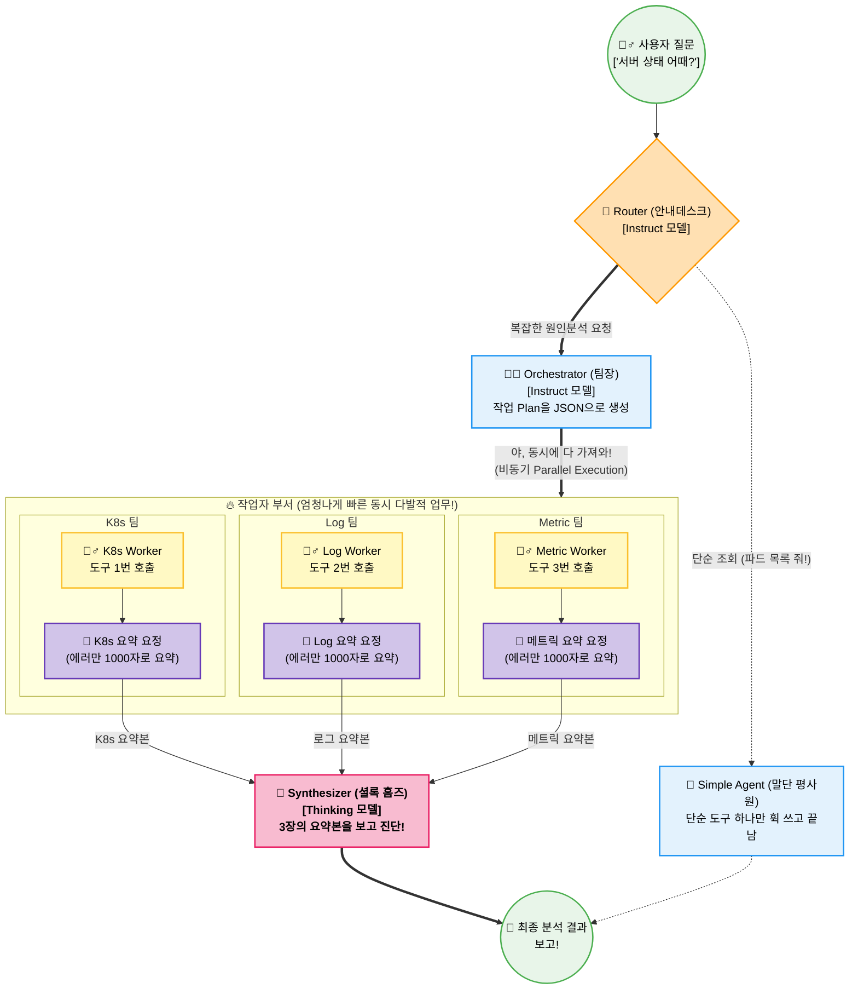

# 🏗️ 2. 핵심 아키텍처 (CORE ARCHITECTURE)

전편에서 우리는 "단일 에이전트"의 한계를 깨닫고, 여러 명의 특화된 AI가 협력하는 형태인 **LangGraph 기반의 분산 아키텍처**로 진화시켰음을 알게 되었습니다.

이번 장에서는 이 AI 회사가 도대체 **"어떻게 그렇게 똑똑하게 일하는지"** 그 조직도(아키텍처)를 아주 쉽게 뜯어보겠습니다! 
단순 코드가 아니니, 한 편의 조직도를 본다고 생각하고 따라와 주세요.

---

## 🧠 1. 두 가지 종류의 AI 직원 (Dual LLM Strategy)

이 프로젝트의 엄청난 인사이트 중 하나는 **"모든 AI에게 똑같은 머리(두뇌)를 주지 않았다"**는 점입니다. 이게 핵심입니다. 
우리는 적재적소에 능력치가 다른 AI 직원을 배치했습니다.

*   🏃 **빠르고 정확 한 규격 담당 (Instruct Model - Qwen Instruct)**
    *   **역할**: JSON 포맷을 어기지 않고 로봇처럼 정확하게, 번개처럼 빠르게 지시를 내립니다.
    *   **결과**: 자기가 말을 유창하게 길게 할 필요 없이 "로그 도구 실행해", "파드 목록 조회해" 같이 딱딱한 명령을 내리기 때문에 에러율이 0%에 수렴합니다.
*   🤔 **깊이 있는 셜록 홈즈 (Thinking Model - Qwen Thinking)**
    *   **역할**: 도구들이 가져온 정보를 차분히 읽어보고 "<think> 아, 이거 DB가 응답이 없어서 웹 서버가 죽었구나... </think>"라며 아주 깊게 사색(추론)합니다.
    *   **결과**: 시간이 오래 걸리는 대신, 소름 돋게 정확한 원인 진단을 내놓습니다.

**"지시는 빠르고 정확하게, 추론은 깊게!"** 이것이 우리 아키텍처의 황금 밸런스입니다.

---

## 🗺️ 2. 전체 워크플로우 (이 회사의 조직도)

사용자(당신)가 질문을 던지면, 이 회사는 다이어그램처럼 일사불란하게 움직입니다! 
아래 다이어그램은 **Notion 등에서도 완벽하게 호환되는 Mermaid 그래프**입니다.

---

## 🔍 3. 부서별 핵심 역할 파헤치기 (Why it's so smart)

다이어그램을 보셨다면 각각의 부서(Node)가 왜 이렇게 설계되었는지 그 속마음을 들여다보겠습니다.

### 🚦 1단계: 안내 데스크 (Router Node)
"쿠버네티스 파드 목록 좀 줘"라는 1초짜리 가벼운 질문에, AI 회사가 전체 회의를 소집하면 바보 같겠죠?
라우터는 질문의 견적을 짭니다.
*   **견적 1**: "단순한 조회네!" 👉 평사원 혼자 도구를 쓰고(Simple Path) 2초 만에 집에 갑니다.
*   **견적 2**: "엇.. '왜 에러 났어?' 같은 추리에 가까운 엄청난 질문인데?" 👉 팀장을 호출(Complex Path)합니다.

### 👨‍💼 2단계: 작업 반장님 (Orchestrator Node)
팀장은 무거운 추론을 하지 않습니다. 그저 "지금 K8s팀은 X를 하고, 로그 팀은 Y를 하고, 메트릭 팀은 Z를 해와라!" 라고 JSON 파일 형태의 **작업지시서(Plan)**를 만듭니다. (*주의: 여기서 절대 포맷이 깨지면 안 되므로 빠르고 정확한 **Instruct 모델**이 투입됩니다.*)

### 🔥 3단계 (초장점): 병렬 처리 + 맵리듀스 (Parallel Workers + Map-Reduce)
이 프로젝트의 가치를 10배로 높여주는 킬러 파트입니다 !!! 

1. **Parallel Execution (병렬 처리)**
   과거에는 K8s 도구를 쓰고, 끝날 때까지 기다렸다가 로그 도구를 불렀습니다. 하지만 이제는 **세 명의 Worker가 "동시에(asyncio.gather)" 각 서버에 도구를 날립니다.** 그래서 30분 걸릴 일이 5초 만에 끝나는 속도(Latency)의 마법이 벌어집니다!

2. **Map-Reduce (서브-에이전트 단기 요약)**
   쿠버네티스 서버가 토해낸 5만 줄짜리 엄청난 텍스트를 대장 셜록 홈즈에게 그대로 갖다주면? **셜록 홈즈 앱이 에러(Context Overflow)를 내며 죽어버립니다.**
   그래서 우리 Worker들한테는 **마법의 요정(Sub-Agent Summarizer)**이 한 명씩 숨어있습니다. 이 요약 요정은 도구가 가져온 엄청난 수만 줄 데이터를 재빨리 스캔해서, **"지금 에러랑 관련된 것만 추려서 1,000자 이내로 핵심만 요약해!" (Map 작업)** 라고 처리한 후 보고합니다. 
   *(이게 바로 LLM의 Context Trap을 피하는 천재적인 기법입니다!)*

### 🧠 4단계: 셜록 홈즈 (Synthesizer Node)
자, 이제 최고 티어 모델(**Thinking 모델**)이 등판합니다. 
이 셜록 홈즈에게는 5만 줄의 더러운 데이터가 아니라, 요약 요정 3명이 깎고 다듬어서 가져온 **깔끔한 핵심 브리핑 3장**만이 책상에 놓입니다. (Reduce 작업)
셜록 홈즈는 토큰 초과 걱정 없이 맘 편하게 이 정보들을 엮어서 아주 깊게 `<think>` 하며 "진짜 흑막(Root Cause)"을 찾아내어 사용자에게 전달합니다.

---

## 🎓 4. SOTA 논문 기반 아키텍처 (Behind the Scenes)

사실 이 똑똑한 조직도는 단순히 감으로 만들어진 것이 아닙니다. 최근 세계적으로 뜨거운 **최신 대형 언어 모델(SOTA LLM) 에이전트 논문들의 정수(핵심 아이디어)**를 AIOps 도메인에 완벽하게 맞춤 조립(Custom-fit)한 결과물입니다.

*   **1️⃣ [HuggingGPT (Microsoft, 2023)](https://arxiv.org/abs/2303.17580) - "전문가 위임 패턴"**
    *   **논문 내용**: 대형 LLM 모델이 복잡한 요청을 분석해 여러 하위 태스크로 쪼개고, 각 전문 모델들에게 나눠준 뒤 결과를 취합하는 "Plan-and-Solve" 패턴의 시초격 논문입니다.
    *   **우리 코드의 적용점**: `Router`와 `Orchestrator`가 작업을 쪼개고, 각기 다른 도구를 다루는 전문 `Workers (Log, Metric, K8s)`에게 임무를 위임하는 전체적인 구조가 바로 이 논문의 철학을 따릅니다.

*   **2️⃣ [LLMCompiler (UC Berkeley, 2023)](https://arxiv.org/abs/2312.04511) - "어셈블리 라인 병렬화"**
    *   **논문 내용**: 이전에는 도구 1번 쓰고 기다렸다가 2번을 쓰는 직렬(Sequential) 구조 때문에 느렸습니다. 이 논문은 컴파일러처럼 실행 계획(DAG)을 짜고 서로 의존성이 없는 도구들을 **동시에 병렬(Parallel) 실행**시켜버립니다.
    *   **우리 코드의 적용점**: 우리의 `Orchestrator`가 JSON 지시서를 뿌리면, 여러 워커들이 **`asyncio.gather`를 통해 동시에(Parallel Execution) 서버에 질의**를 날리는 폭발적인 스피드의 비결입니다!

*   **3️⃣ [ReWOO (2023)](https://arxiv.org/abs/2305.18323) - "사고(Reasoning)와 관찰(Observation)의 분리"**
    *   **논문 내용**: 에이전트가 도구를 쓸 때마다 생각과 데이터를 섞으면 토큰이 터지는(Context Overflow) 현상을 막기 위해, 단순 작업자(Worker)는 뇌를 비우고 데이터만 가져오게 하고, 똑똑한 모델이 마지막에 취합하는 구조를 제안했습니다.
    *   **우리 코드의 적용점**: 이 시스템의 핵심 자산인 `Sub-Agent Summarizer (요약 요정)`가 바로 이 역할입니다. 워커들은 스스로 복잡한 판단을 하지 않고 오직 데이터에서 핵심만 뽑아 단기 요약(Map)을 한 뒤 셜록 홈즈(`Synthesizer`)에게 바칩니다.

원리가 어떠신가요? 직렬 구조의 둔감한 비서 한 명에서, **각자 할 일 딱딱 나눠서 일사불란하게 움직이는 환상의 AI 팀워크**로 진화했음을 알 수 있습니다! 

이제 이 그림들이 코드로 어떻게 구현되었는지 궁금하시죠? 손가락에 기름 묻힐 시간입니다. 다음 장인 `3_CODE_WALKTHROUGH.md`에서 이 조직도를 **실제 파이썬 코드(`agent_graph.py`) 한 줄 한 줄**로 연결해 드리겠습니다. (전혀 쫄지 마세요, 아주 쉽습니다!) 👉

> 💡 **조금 더 기술적으로 깊은 이야기를 원하시나요?**
> * ⚡ [5만줄의 로그를 어떻게 1초만에 요약할까? 병렬 처리와 맵-리듀스 아키텍처 파헤치기](../advanced_docs/2_PARALLEL_WORKERS_AND_MAP_REDUCE.md)
